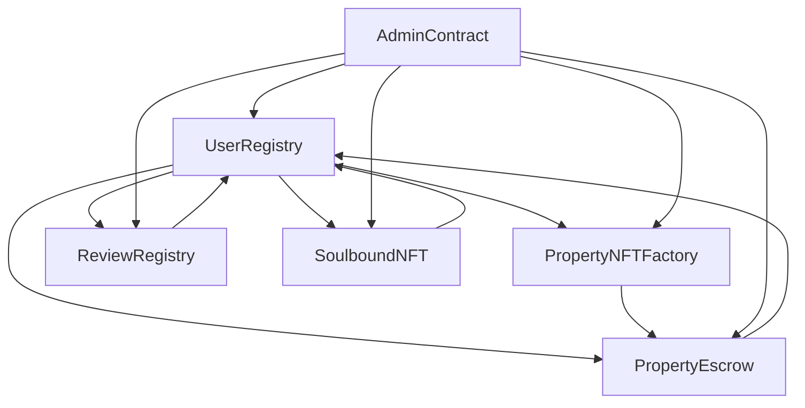

# ProptyChain Smart Contracts

A comprehensive Web3-powered real estate platform built on Ethereum Layer-2 networks (Mantle) that brings transparency, trust, and accessibility to global property markets.

## 🏗️ Architecture Overview

ProptyChain consists of six core smart contracts that work together to create a decentralized real estate ecosystem:

### Core Contracts

1. **UserRegistry** - User identity and reputation management
2. **PropertyNFTFactory** - Property NFT creation and management
3. **ReviewRegistry** - Property review system with IPFS storage
4. **PropertyEscrow** - Secure transaction escrow system
5. **SoulboundNFT** - Achievement-based gamification system
6. **AdminContract** - Platform oversight and dispute resolution

### 🚀 Live Deployment (Mantle Sepolia)
The following contracts have been deployed to the Mantle Network:

- **AdminContract**: `0x5FbDB2315678afecb367f032d93F642f64180aa3`
- **UserRegistry**: `0xe7f1725E7734CE288F8367e1Bb143E90bb3F0512`
- **PropertyNFTFactory**: `0x9fE46736679d2D9a65F0992F2272dE9f3c7fa6e0`
- **ReviewRegistry**: `0xCf7Ed3AccA5a467e9e704C703E8D87F634fB0Fc9`
- **SoulboundNFT**: `0xDc64a140Aa3E981100a9becA4E685f962f0cF6C9`
- **PropertyEscrow**: `0x5FC8d32690cc91D4c39d9d3abcBD16989F875707`

**📋 Full deployment details**: [DEPLOYMENT_SUMMARY.md](./DEPLOYMENT_SUMMARY.md)

## 📋 Contract Details

### UserRegistry
- **Purpose**: Manages user registration, identity, and role-based access control
- **Key Features**:
  - User registration with Ethereum address and DID
  - Role-based access (Seeker, Owner, Agent, Representative)
  - Reputation scoring system
  - One address per user policy

### PropertyNFTFactory
- **Purpose**: Creates and manages property NFTs with metadata
- **Key Features**:
  - Property NFT minting with metadata
  - Freemium model (2 free uploads, then $3/month subscription)
  - Property listing/unlisting functionality
  - Metadata updates and management

### ReviewRegistry
- **Purpose**: Manages property reviews stored on IPFS
- **Key Features**:
  - Review submission with IPFS storage
  - Review validation and reporting system
  - Rating system (1-5 stars)
  - Automatic review invalidation for false reviews

### PropertyEscrow
- **Purpose**: Handles secure property transactions
- **Key Features**:
  - Smart contract escrow for secure transactions
  - Dispute resolution system
  - Platform fee collection (2%)
  - Automatic property transfer upon completion

### SoulboundNFT
- **Purpose**: Achievement-based gamification system
- **Key Features**:
  - Non-transferable achievement badges
  - Badge types: Trusted Owner, Top Reviewer, Verified Professional, etc.
  - Level-based badge system (1-5 levels)
  - Reputation-based badge requirements

### AdminContract
- **Purpose**: Central platform management and oversight
- **Key Features**:
  - Dispute creation and resolution
  - User verification system
  - Content moderation (property/review removal)
  - Platform statistics and analytics

## 🚀 Quick Start

### Prerequisites
- Node.js (v16 or higher)
- npm or yarn
- Hardhat
- MetaMask or other Web3 wallet

### Installation

1. **Clone the repository**
```bash
git clone <repository-url>
cd ProptyChain-smartcontract
```

2. **Install dependencies**
```bash
npm install
```

3. **Set up environment variables**
```bash
cp env.example .env
# Edit .env with your configuration
```

4. **Compile contracts**
```bash
npm run compile
```

5. **Run tests**
```bash
npm test
```

## 🚀 Deployment

### Deployment Status

Contracts will be deployed to Mantle Sepolia Testnet (Chain ID: 5003)

**Network**: Mantle Sepolia Testnet (Chain ID: 5003)  
**Status**: Ready for deployment ✅

### Deployment Commands

1. **Deploy to local network**
```bash
npx hardhat node
npx hardhat run scripts/deploy.ts --network localhost
```

2. **Deploy to Mantle Sepolia testnet**
```bash
npm run deploy:mantle-sepolia
```

3. **Deploy and verify in one command**
```bash
npm run deploy-and-verify:mantle-sepolia
```

## 🔧 Configuration

### Environment Variables

Create a `.env` file with the following variables:

```env
# Private key for deployment
PRIVATE_KEY=your_private_key_here

# Network RPC URLs
MANTLE_SEPOLIA_RPC_URL=https://rpc.sepolia.mantle.xyz

# Block Explorer API Keys
MANTLE_EXPLORER_API_KEY=your_mantle_explorer_api_key_here

# IPFS Configuration
PINATA_API_KEY=your_pinata_api_key_here
PINATA_SECRET_KEY=your_pinata_secret_key_here
```

### Network Configuration

The contracts are configured to work on:
- **Mantle Sepolia** (Ethereum L2) - Testnet (Chain ID: 5003)

## 📖 Usage Examples

### User Registration
```solidity
// Register a new user
await userRegistry.registerUser(
    "John Doe",
    "did:ethr:0x123...",
    UserRegistry.UserRole.SEEKER
);
```

### Property Creation
```solidity
// Create a property NFT
await propertyFactory.createProperty(
    PropertyNFTFactory.PropertyType.RESIDENTIAL,
    "Lagos, Nigeria",
    ethers.utils.parseEther("100000"), // 100,000 ETH
    "Monthly payment plan available",
    "QmHash...", // IPFS hash for additional metadata
    "https://metadata.uri"
);
```

### Review Submission
```solidity
// Submit a property review
await reviewRegistry.submitReview(
    1, // propertyId
    ReviewRegistry.ReviewType.RESIDENT,
    "QmReviewHash...", // IPFS hash for review content
    5, // rating (1-5)
    "Property conditions"
);
```

### Escrow Transaction
```solidity
// Create escrow for property purchase
await propertyEscrow.createEscrow(
    1, // propertyId
    "0xSellerAddress...",
    "QmTermsHash..." // IPFS hash for transaction terms
);

// Fund the escrow
await propertyEscrow.fundEscrow(1, { value: ethers.utils.parseEther("100000") });
```

## 🧪 Testing

Run the test suite:
```bash
npm test
```

Run specific test files:
```bash
npx hardhat test test/UserRegistry.test.ts
npx hardhat test test/PropertyNFTFactory.test.ts
```

## 🔒 Security Features

- **OpenZeppelin Contracts**: Uses battle-tested security libraries
- **Access Control**: Role-based permissions and ownership controls
- **Reentrancy Protection**: Guards against reentrancy attacks
- **Input Validation**: Comprehensive parameter validation
- **Emergency Functions**: Admin controls for emergency situations

## 📊 Gas Optimization

- **Efficient Storage**: Optimized data structures and mappings
- **Batch Operations**: Support for batch processing where applicable
- **Lazy Loading**: On-demand data retrieval patterns
- **Gas-Efficient Loops**: Optimized iteration patterns

## 🌐 IPFS Integration

The platform uses IPFS for decentralized storage of:
- Property metadata and images
- Review content and attachments
- Transaction terms and documents
- Badge metadata and achievements

## 🎯 Badge System

### Available Badges
1. **Trusted Owner** - For property owners with good reputation
2. **Top Reviewer** - For active and helpful reviewers
3. **Verified Professional** - For verified real estate professionals
4. **First Property** - For first-time property uploaders
5. **Successful Transaction** - For completed property transactions
6. **Community Contributor** - For active community members
7. **Early Adopter** - For early platform users
8. **Premium Member** - For subscription holders

### Badge Requirements
Each badge has specific requirements based on:
- Number of properties owned
- Number of reviews submitted
- Reputation score
- Number of successful transactions
- Days active on platform

## 🔄 Contract Interactions



## 📈 Platform Statistics

The AdminContract provides comprehensive platform analytics:
- Total users registered
- Total properties created
- Total reviews submitted
- Total escrow transactions
- Total disputes resolved
- Platform revenue
- Active subscriptions

## 🚨 Emergency Procedures

### Pause Platform
```solidity
await adminContract.pausePlatform("Emergency maintenance");
```

### Emergency Refund
```solidity
await propertyEscrow.emergencyRefund(escrowId);
```

### Emergency Dispute Closure
```solidity
await adminContract.emergencyCloseDispute(disputeId);
```

## 🔧 Maintenance

### Update Platform Fees
```solidity
await adminContract.updatePlatformFee(3); // 3%
```

### Update Platform Limits
```solidity
await adminContract.updatePlatformLimits(100, 200, 150);
```

### Award Badges
```solidity
await adminContract.awardBadgeToUser(
    userAddress,
    SoulboundNFT.BadgeType.TRUSTED_OWNER,
    "QmBadgeHash...",
    1
);
```

## 📝 License

This project is licensed under the MIT License - see the LICENSE file for details.

## 🤝 Contributing

1. Fork the repository
2. Create a feature branch
3. Make your changes
4. Add tests for new functionality
5. Ensure all tests pass
6. Submit a pull request

## 📞 Support

For support and questions:
- Create an issue in the repository
- Join our Discord community
- Email: support@proptychain.com

## 🔮 Roadmap

- [ ] Multi-chain deployment (Polygon, Arbitrum)
- [ ] Advanced dispute resolution with DAO governance
- [ ] Integration with DeFi protocols for property financing
- [ ] Mobile app with wallet integration
- [ ] AI-powered property valuation
- [ ] International property support
- [ ] Advanced analytics dashboard

---

**Built with ❤️ for the future of real estate**
