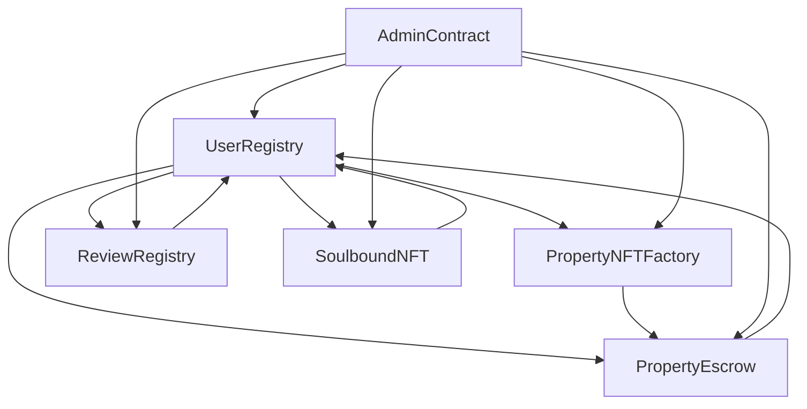

# ProptyChain Smart Contracts - Complete Implementation

## 🎯 Project Overview

ProptyChain is a comprehensive Web3-powered real estate platform that addresses critical challenges in the Nigerian and African real estate markets through blockchain technology, community verification, and AI-driven insights.

## 📋 Implemented Smart Contracts

### 1. UserRegistry.sol
**Purpose**: Central user identity and reputation management system

**Key Features**:
- ✅ User registration with Ethereum address and DID (Decentralized Identifier)
- ✅ Role-based access control (Seeker, Owner, Agent, Representative)
- ✅ Reputation scoring system with on-chain tracking
- ✅ One address per user policy to prevent duplicate registrations
- ✅ User deactivation and role management
- ✅ Integration with other contracts for reputation updates

**Core Functions**:
- `registerUser()` - Register new users with role selection
- `getUser()` - Retrieve user information
- `updateReputation()` - Update user reputation scores
- `isUserActive()` - Check user status
- `getTotalUsers()` - Platform statistics

### 2. PropertyNFTFactory.sol
**Purpose**: Property NFT creation and management with freemium model

**Key Features**:
- ✅ Property NFT minting with comprehensive metadata
- ✅ Freemium model: 2 free uploads, then $3/month subscription
- ✅ Property types: Residential, Commercial, Land, Hotel, Shortlet
- ✅ Property listing/unlisting functionality
- ✅ Metadata updates and management
- ✅ IPFS integration for additional property data
- ✅ Subscription management with automatic renewal

**Core Functions**:
- `createProperty()` - Mint new property NFTs
- `purchaseSubscription()` - Buy premium subscription
- `setPropertyListed()` - List/unlist properties
- `updatePropertyMetadata()` - Update property details
- `canUploadMore()` - Check upload eligibility

### 3. ReviewRegistry.sol
**Purpose**: Decentralized property review system with IPFS storage

**Key Features**:
- ✅ Review submission with IPFS storage (Pinata integration)
- ✅ Review types: Resident, Past Tenant, Community Member
- ✅ Rating system (1-5 stars) with category classification
- ✅ Review validation and reporting system
- ✅ Automatic review invalidation for false reviews (3+ reports)
- ✅ Property removal for excessive negative reviews (5+)
- ✅ Reputation impact on review submission

**Core Functions**:
- `submitReview()` - Submit property reviews
- `reportReview()` - Report false/inappropriate reviews
- `getPropertyReviews()` - Retrieve reviews for properties
- `getPropertyReviewStats()` - Get review statistics
- `invalidateReview()` - Admin review removal

### 4. PropertyEscrow.sol
**Purpose**: Secure property transaction escrow system

**Key Features**:
- ✅ Smart contract escrow for secure transactions
- ✅ Multi-step transaction process (Create → Fund → Approve → Complete)
- ✅ Dispute resolution system with admin oversight
- ✅ Platform fee collection (2% of transaction value)
- ✅ Automatic property NFT transfer upon completion
- ✅ Emergency functions for stuck transactions
- ✅ Transaction terms stored on IPFS

**Core Functions**:
- `createEscrow()` - Create escrow for property purchase
- `fundEscrow()` - Fund escrow with payment
- `approveEscrow()` - Approve transaction completion
- `raiseDispute()` - Create dispute for transaction
- `resolveDispute()` - Admin dispute resolution
- `emergencyRefund()` - Emergency transaction handling

### 5. SoulboundNFT.sol
**Purpose**: Achievement-based gamification system with non-transferable badges

**Key Features**:
- ✅ Non-transferable achievement badges (Soulbound NFTs)
- ✅ Badge types: Trusted Owner, Top Reviewer, Verified Professional, etc.
- ✅ Level-based badge system (1-5 levels)
- ✅ Reputation-based badge requirements
- ✅ Badge revocation and level-up functionality
- ✅ Integration with user activities and achievements

**Core Functions**:
- `awardBadge()` - Award badges to users
- `checkBadgeEligibility()` - Check if user qualifies for badge
- `revokeBadge()` - Revoke badges (admin only)
- `levelUpBadge()` - Increase badge level
- `getUserBadges()` - Get user's badge collection

### 6. AdminContract.sol
**Purpose**: Central platform management and oversight system

**Key Features**:
- ✅ Dispute creation and resolution across all contract types
- ✅ User verification system with reputation requirements
- ✅ Content moderation (property/review removal)
- ✅ Platform statistics and analytics
- ✅ Platform fee and limit management
- ✅ Emergency platform pause functionality
- ✅ Badge awarding and management

**Core Functions**:
- `createDispute()` - Create platform disputes
- `resolveDispute()` - Resolve disputes with outcomes
- `verifyUser()` - Verify user accounts
- `removeProperty()` / `removeReview()` - Content moderation
- `getPlatformStats()` - Platform analytics
- `pausePlatform()` - Emergency platform control

## 🔗 Contract Interactions

## 🏗️ Technical Architecture

### Blockchain Infrastructure
- **Networks**: Mantle (Ethereum Layer-2)
- **Smart Contracts**: 6 interconnected contracts
- **Security**: OpenZeppelin standards and best practices
- **Gas Optimization**: Efficient storage and operation patterns

### Storage Strategy
- **On-Chain**: User data, property metadata, transaction records
- **IPFS**: Review content, property images, transaction terms
- **No Subgraph**: Direct contract queries for MVP

### Security Features
- ✅ Access control and ownership management
- ✅ Reentrancy protection
- ✅ Input validation and sanitization
- ✅ Emergency pause functionality
- ✅ Dispute resolution mechanisms

## 💰 Revenue Model Implementation

### Subscription System
- **Free Tier**: 2 property uploads for new users
- **Premium**: $3/month for unlimited uploads
- **Target**: 1,000 paying users by July 2025

### Transaction Fees
- **Platform Fee**: 2% of property transaction value
- **Escrow Management**: Secure transaction handling
- **Dispute Resolution**: Admin oversight and resolution

## 🎯 Key Differentiators Implemented

1. **Human + AI Verification**: Community reviews with reporting system
2. **Simplified Web3 UX**: Role-based access and clear user flows
3. **Soulbound NFT Rewards**: Non-transferable achievement system
4. **Global Vision, Local Start**: Nigeria-focused with global scalability
5. **Subscription Model**: Sustainable revenue vs. token speculation

## 🚀 Deployment Configuration

### Networks Supported
- **Mantle Sepolia Testnet** (Chain ID: 5003)
- **Local Development** (Chain ID: 31337)

### Environment Configuration
- Network RPC URLs
- Private keys for deployment
- Block explorer API keys
- IPFS configuration (Pinata)
- Platform parameters

## 📊 Platform Statistics

The AdminContract provides comprehensive analytics:
- Total users registered
- Total properties created
- Total reviews submitted
- Total escrow transactions
- Total disputes resolved
- Platform revenue tracking
- Active subscription count

## 🔧 Development Tools

### Testing
- Comprehensive test suite for all contracts
- Integration testing for contract interactions
- Gas optimization testing
- Security testing scenarios

### Deployment
- Automated deployment script
- Contract verification support
- Deployment address tracking
- Environment-specific configurations

### Documentation
- Detailed README with usage examples
- Contract interaction diagrams
- Security considerations
- Maintenance procedures

## 🎉 Next Steps

1. **Testing**: Run comprehensive test suite
2. **Audit**: Security audit before mainnet deployment
3. **Frontend Integration**: Connect with React frontend
4. **IPFS Setup**: Configure Pinata for metadata storage
5. **Testnet Deployment**: Deploy to Mantle Sepolia for testing
6. **Mainnet Launch**: Deploy to Mantle mainnet (when available)

## 📝 Contract Addresses

After deployment, contract addresses will be saved to:
- `deployment-{timestamp}.json`
- Environment variables
- Frontend configuration

---

**Status**: ✅ Complete Implementation
**Ready for**: Testing and deployment
**Next Phase**: Frontend integration and mainnet launch
